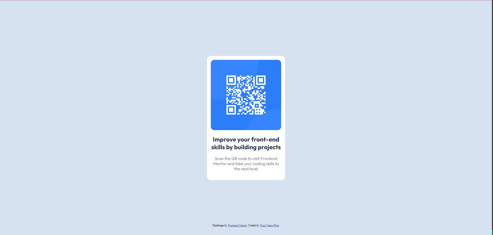

# Frontend Mentor - QR code component solution

This is a solution to the [QR code component challenge on Frontend Mentor](https://www.frontendmentor.io/challenges/qr-code-component-iux_sIO_H). Frontend Mentor challenges help you improve your coding skills by building realistic projects. 

## Table of contents

- [Overview](#overview)
  - [Screenshot](#screenshot)
  - [Links](#links)
  - [Built with](#built-with)
  - [Continued development](#continued-development)
- [Author](#author)

## Overview

### Screenshot

### Links

- Live Site URL: [Live Site URL on GitHub](https://amarcyclechurikoiraloiaghese.github.io/QR-Code/)

### Built with

- Semantic HTML5 markup
- CSS custom properties
- Flexbox

### Continued development

I realized I need a deeper understanding when it comes to responsiveness, so I'll focus more on that in my future projects.

## Author

- Frontend Mentor - [@AmarCycleChuriKoiraLoiaGhese](https://www.frontendmentor.io/profile/AmarCycleChuriKoiraLoiaGhese)
